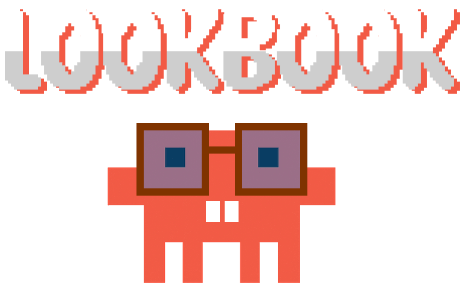

<div align="center">
  

  <p>
    <a href="https://ko-fi.com/jalonlivan">
      
    </a>
    
    
    
  </p>
</div>

# lookbook

**Pick how your site looks before Claude writes a single line of UI code.**

Left unconstrained, models converge on the same page: Inter, an indigo gradient
on white, rounded cards, a three-icon feature grid. That is not a bug, it is
distributional convergence. Safe choices dominate the training data.

lookbook fixes the input side. A human clicks a look in a local web UI, and the
result is a token file that every UI-generating skill in the project reads and
obeys. Then `mark` turns that same pick into a real logo and a full favicon set.

---

## Install

### Option A: as a plugin (recommended)

In Claude Code, run:

```
/plugin marketplace add jalonlivan/claude-lookbook
/plugin install lookbook@claude-lookbook
```

That gives you both skills and the `/lookbook` slash command in one step.
Restart Claude Code if the command does not appear immediately.

### Option B: manually

Clone the repo and copy the two skill folders into your skills directory:

```bash
git clone https://github.com/jalonlivan/claude-lookbook.git
cd claude-lookbook

# personal install, available in every project
mkdir -p ~/.claude/skills ~/.claude/commands
cp -r lookbook mark ~/.claude/skills/
cp commands/lookbook.md ~/.claude/commands/
```

For a single project instead, copy into `.claude/skills/` and
`.claude/commands/` inside that project.

### Requirements

Python 3.8 or newer, and nothing else. No pip, no npm, no build step, no API
key. Every script in here uses only the standard library, including the PNG and
ICO encoders and the TrueType font rasterizer.

Check it is working:

```bash
python lookbook/scripts/pick.py --project . --preset brutalist
```

---

## Use it

```
/lookbook
```

That opens the picker, hands you a URL, and waits while you choose. When you
submit, Claude reads your pick and carries on.

| command | what it does |
| --- | --- |
| `/lookbook` | open the picker and wait for a choice |
| `/lookbook void` | skip the UI and write that preset directly |
| `/lookbook --force` | re-pick, replacing an existing choice |
| `/lookbook --emit-html` | write an offline picker that needs no server |
| `/lookbook --status` | show the current pick without launching anything |

You can also just ask. Both skills carry descriptions that Claude matches on,
so "give this site a visual direction" or "make a favicon for this app" will
reach them without the slash command.

---

## What you are choosing between

Step one is the ground, because it is the decision everything else hangs off.

### Light ground: colour in the ink

A pale ground, a pigment accent, elevation by shadow.

| preset | the look |
| --- | --- |
| `editorial-warm` | serif display, cream ground, one warm accent, near-zero radius |
| `swiss-neutral` | grotesk, white and black, one accent, visible grid, generous whitespace |
| `brutalist` | weight extremes, hard edges, one loud colour, no shadow |
| `product-dense` | muted and low-saturation, tight radii, high information density |

### Dark ground: colour in the emission

This is not dark mode. Dark mode is a colour inversion. These pages are **lit**:
one thing glows, everything else stays near-monochrome so the glow reads, and
the interface is built out of 1px hairline borders instead of shadows.

| preset | the look |
| --- | --- |
| `void` | pure black, one spotlit chromatic object, pill buttons, logo wall |
| `platform` | deep navy, soft glow behind dimensional objects, a saturated CTA that is deliberately not the glow colour |
| `bloom` | near-black with a grained aurora, monospace code panel, saturated pill CTA |
| `gallery` | navy washing to blue, one italic serif word in a sans headline, a grid of work |
| `console` | flat dark app chrome, hairline borders, one restrained accent, full state coverage |
| `dark-luxe` | near-black ground, thin type, image-led, minimal chrome |

Plus `custom`, which is the strongest path rather than a fallback. Upload a
screenshot and write free-text instructions. A picture beats prose because it
stops the model reaching for a familiar archetype.

Every preset ships concrete values, not adjectives. Full tables are in
[`lookbook/references/presets.md`](lookbook/references/presets.md).

---

## Features

### The picker previews itself

Each card renders in its own tokens, including its lighting. A spot glow, a
grained aurora, a navy-to-blue wash and a flat console all look like themselves
in the grid, because lighting is the thing you are choosing and the first thing
a small thumbnail loses.

### It writes tokens, not vibes

`.claude/branding.json` carries exact values: six colours, a ground and its hue
cast, a lighting spec, hairline and raise colours, display, body and monospace
faces with weights, a type scale, four radii, a spacing base, density, and
motion timing.

### The avoid list is generated per project

Rather than a global "never purple" rule, which would be wrong because plenty of
brands are deliberately purple, the list forbids **the default nobody chose**.
It is built relative to your picked palette, so entries that contradict your
accent are dropped automatically, and a line naming your exact accent is always
appended. `bloom` is deliberately purple and says so on the card.

Two content rules hold across every preset: no generic font stack, and no em
dashes in headings or body copy. Distinctive visuals wrapped in generic
AI-tell prose still read as generic AI-tell prose.

### Optional light and dark palettes

A preset carries an `altMode` palette where the reference genuinely has one.
Where it does not, `altMode` is explicitly `null`, and that null is an
instruction: this look has no other mode, so do not invent one.

### It works over SSH

The server binds `127.0.0.1`, which means *this machine*. When your terminal is
on a remote box, your browser is not, so lookbook detects that and prints the
exact `ssh -L` line to forward the port, with your real host and port filled in.
If you are connected through the VS Code or Cursor extension, the port is
usually forwarded already and the URL simply works.

Where no port can be forwarded at all, `--emit-html` writes a single
self-contained HTML file with everything inlined. You open it however you can,
pick a look, and it hands you a command to paste back into your terminal. That
paste is what writes the config.

### It never surprises you

If a valid `.claude/branding.json` already exists, lookbook exits immediately
and launches nothing. Without that, every run would pop a browser window and
the skill would be uninstalled within a week. Use `--force` to re-pick.

### It is safe to run on a shared machine

A localhost server is reachable by any page in your browser, so lookbook binds
`127.0.0.1` only, mints a fresh random token per launch and requires it on every
request, compares it in constant time, rejects cross-origin requests, sends a
restrictive CSP, serves a fixed whitelist of files with no traversal surface,
validates uploads by magic bytes rather than extension, and self-terminates
after a timeout so an abandoned run leaves nothing listening.

---

## mark: logos and favicons

The second skill turns your pick into real files. Claude's usual reflex for a
logo is a `<div>` with Tailwind classes, which cannot go in a browser tab, an
iOS home screen, a PWA manifest or a README.

```bash
python mark/scripts/mark.py --project . text  --text "Acme Supply" --font Georgia
python mark/scripts/mark.py --project . shape --shape ring
python mark/scripts/mark.py --project . image --image assets/logo.png
```

Three sources, one pipeline, and colours and corner radius come from
`branding.json` automatically. A brand that chose square corners gets a square
icon.

It writes `favicon.ico` with 16, 32 and 48 in one container, the modern PNG
sizes, an opaque `apple-touch-icon.png` because iOS composites alpha onto black,
maskable PWA icons with a wider safe zone, `site.webmanifest`, the `<head>`
snippet, and **real vector SVGs** built from outline paths rather than `<text>`,
so they render anywhere without the font installed.

Font handling is done from scratch: a TrueType parser, glyph outline extraction
including composite glyphs, and an antialiased scanline rasterizer, all in the
standard library. Style matching uses the numeric `OS/2` weight class rather
than the subfamily string, because on a localised Windows that string reads
"Negreta" rather than "Bold".

Run `--list-fonts` to see what is installed, and `--list-shapes` for the
procedural marks.

---

## For skill authors

Any UI-generating skill should declare lookbook as a precondition. One-way: it
does not import lookbook, wrap it, or reimplement it.

```markdown
## Before generating any UI

1. Check for `.claude/branding.json`.
2. If missing or invalid, run:
   `python <lookbook>/scripts/pick.py --project . --print-url`
   Give the user the URL, then poll for the file.
3. Read the tokens. Use them exactly. Do not substitute defaults for anything
   the file specifies.
4. Read every image in `references[]` before writing markup.
```

The schema is versioned. A v1 file is migrated on read rather than rejected, so
an existing install keeps its look and is never sent back to the picker, and
every field added since is optional so older consumers keep working.

---

## Layout

```
.claude-plugin/     plugin and marketplace manifests
commands/           the /lookbook slash command
lookbook/           the picker skill
  scripts/          pick.py (CLI and server), schema.py (tokens and validation)
  assets/ui/        one HTML file, inline CSS and JS, no build step
  references/       full token tables per preset
mark/               the logo and favicon skill
  scripts/          mark.py, fonts.py, imgio.py, raster.py
```

## Support

lookbook is free and always will be, and nothing in it is gated. If it saved
you an afternoon of arguing with a model about fonts, you are welcome to buy me
a coffee. Entirely optional, and genuinely appreciated.

<a href="https://ko-fi.com/jalonlivan">
  
</a>

Starring the repo or telling someone about it helps just as much.

## License

MIT.
